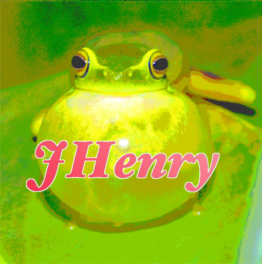
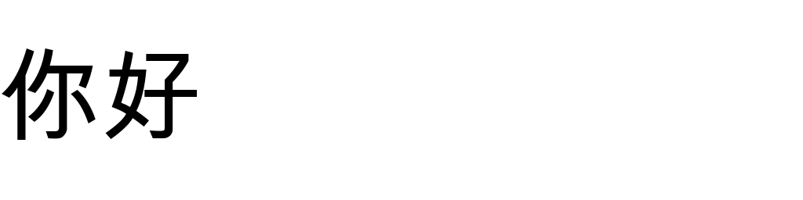

# Julian Henry

Full-stack dev & full-time futurist, based in Houston.

> *May you implement beautiful methods in harmony with the data structures of life's source code.*

📝 [juleshenry.github.io](https://juleshenry.github.io)

## Things I've built

**Images & vision**
- [superwand](https://github.com/juleshenry/superwand): magic-wand bounding boxes that breathe life into images
- [zooplankton-image-tool](https://github.com/juleshenry/zooplankton-image-tool) and [quantum-plankton-ml](https://github.com/juleshenry/quantum-plankton-ml): plankton imaging, classical and quantum ML
- [physical-menu-to-website](https://github.com/juleshenry/physical-menu-to-website): photo of a menu in, website out
- [marionet](https://github.com/juleshenry/marionet): full-body sign language onto portable VRM avatars

**Languages**
- [mr.worldwide](https://github.com/juleshenry/mr.worldwide): one word in, a gif of it translated across many languages out
- [polyglot-poster](https://github.com/juleshenry/polyglot-poster): OCR a French textbook into a six-language wall poster
- [readme_rosetta](https://github.com/juleshenry/readme_rosetta): auto-translated READMEs
- [vulgultra](https://github.com/juleshenry/vulgultra): Latin Vulgate Ultra
- [jjokji](https://github.com/juleshenry/jjokji): my language notes and an Anki deck CLI

**Tools & experiments**
- [tatuagem](https://github.com/juleshenry/tatuagem): ASCII signature generator
- [ghee](https://github.com/juleshenry/ghee): shell shortcut manager
- [vakyume](https://github.com/juleshenry/vakyume): metaprogramming inspired by vacuum theory
- [intersekt](https://github.com/juleshenry/intersekt): WASM Karatsuba test
- [rafaga](https://github.com/juleshenry/rafaga): exploring VIX models in Julia
